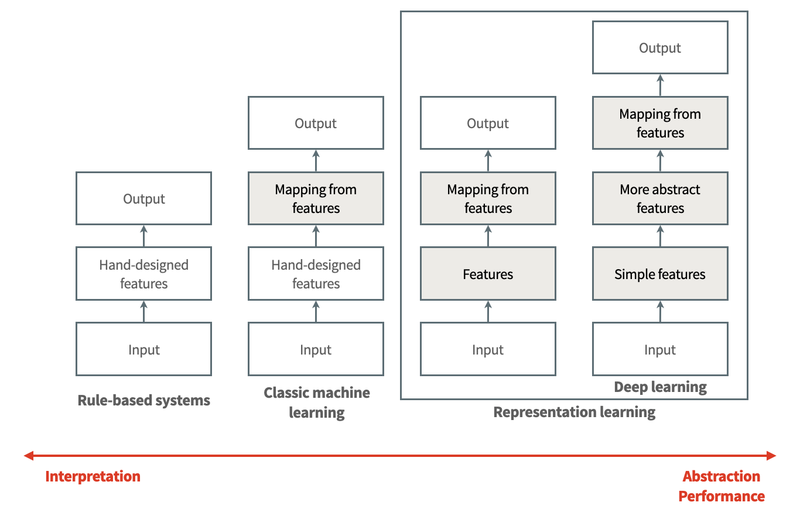

<!-- _class: titlepage-->

<!-- 
 -->

# Earth Data Science

Lecture by Léonard Seydoux the master-level classes of the [institut de physique du globe de Paris](https://www.ipgp.fr) with contents inspired by the [scikit-learn](https://scikit-learn.org/stable/) Python library documentation and the [deep learning](https://www.deeplearningbook.org/) book of Ian Goodfellow.

[ `leonard-seydoux/earth-data-science`](https://github.com/leonard-seydoux/earth-data-science)

<!-- 
 -->

---

<!-- paginate: true -->

## Goals of this course

### Learn about statistical inference, machine learning, and deep learning.

1. Identify scientific problems in need for data science tools
1. Define the problem and adequate analysis workflows
1. Train on real examples
1. Read AI-based papers with a critical eye

---

## Outlines of this course

1. Introduction on machine learning
2. Deep learning, perceptrons
3. Backpropagation, and gradient descent
4. Generalization error
5. Convolutional neural networks
6. Applications in seismology
7. Other aspects

---

<!-- _class: titlepage-->

<!-- 
 -->

# 1. Introduction

### 1.1. Motivations

What kind of problems can we solve with artificial intelligence?

[ `leonard-seydoux/earth-data-science`](https://github.com/leonard-seydoux/earth-data-science)

---

## How much time do you need to describe the following images?

<!-- _footer:  [Karpathy & Fei-Fei (2015)](https://cs.stanford.edu/people/karpathy/cvpr2015.pdf) -->

---

## How accurate are those descriptions?

<!-- _footer:  [Karpathy & Fei-Fei (2015)](https://cs.stanford.edu/people/karpathy/cvpr2015.pdf) -->

---

## Ingredients for image captioning

<!-- _footer: from Goodfellow et al. (2016) -->

---

## Can you spot the seismogram?

<!-- _footer: from Valentine & Trampert (2012). Top to bottom: FTSE; Temperature in Central England; Gaussian noise; Long-period seismogram.-->

---

## Detection and classification of events from seismograms

Most humans can pinpoint events. 
 

<!-- _footer: modified from Moran et al. (2008) -->

---

## Detection and classification of events from seismograms

Most humans can pinpoint events. 
Experts can also classify them.

<!-- _footer: modified from Moran et al. (2008) -->

---

## Diving into previously unseed data

Expert-detected marsquake within continuous insight data.

<!-- _footer: Clinton et al. (2021) -->

---

## Machine learning to solve tasks that are hard to program

- Tasks that do not find a solution in a reasonable time
- Tasks that are too complex to be programmed
- Tasks that are too complex to be described

---

## What is machine learning?

__Definition of a learning algorithm__ 
An algorithm learns from experience $E$ with respect to a tasks $T$ and performance $P$, if its performance at tasks in $T$ improves with experience $E$.

<!-- _footer: from Goodfellow et al. (2016) -->

---

## The data, the model, and the loss

__The data__ is a set of examples with 

$$\mathcal{D} = \{(\mathbf{x}_i, \mathbf{y}_i)\}_{i=1}^N$$

where $\mathbf{x}_i$ is the input and $\mathbf{y}_i$ is the output. __The model__, a function $f_\theta$ that maps data $\mathbf{x}$ to a prediction $\hat{\mathbf{y}}$:

$$\hat{\mathbf{y}} = f_\theta(\mathbf{x})$$

and __the loss__, a function $\mathcal{L}$ that measures the error between the prediction error:

$$\mathcal{L}(\hat{\mathbf{y}}, \mathbf{y})$$

__Learning = find the parameters $\theta^*$ that minimizes the loss $\mathcal{L}$.__

---

## Useful definitions

| Symbol | Name |
|-|-|
|$\left\{ \mathbf{x}_i \in \mathbb{X} \right\}_{i =  1\ldots N}$| Collection of __data samples__|
|$\left\{ \mathbf{y}_i \in \mathbb{Y} \right\}_{i =  1\ldots N}$| Collection of __labels__|
|$\mathbf{x}=\{x_1, \ldots x_F\}$| Set of sample __features__|
|$\mathbf{y}=\{y_1, \ldots y_T\}$| Set of label __targets__|
|$N$| Dataset __dimension__|
|$F$| Feature space dimension|
|$T$| Target space dimension|
|$\mathbb{X}$| Data space|
|$\mathbb{Y}$| Label space|

---

## Main types of machine learning

__Unsupervised learning__: experience features only, learns properties such as data distribution $p(\mathbf{x})$, or data structure (clustering,  reduction).

__Supervised learning__ experiences examples with features $\mathbf{x}_i \in \mathbb{X}$ and labels $\mathbf{y} \in \mathbb{Y}$ to predict from the features (regression, classification). 

__Reinforcement learning__ experiences a sequence of states, actions, and rewards, learns a policy to maximize the reward. 

<!-- _footer: illustration from __www.mathworks.com__  -->

---

## Supervised learning

__Supervised learning__ experiences a set of examples containing features $\mathbf{x}_i \in \mathbb{X}$ associated with labels $\mathbf{y} \in \mathbb{Y}$ to be predicted from the features (regression, classification).

<!-- _footer: $^*$from Goodfellow et al. (2016) -->

---

## Supervised learning

__Supervised learning__ experiences a set of examples containing features $\mathbf{x}_i \in \mathbb{X}$ associated with labels $\mathbf{y} \in \mathbb{Y}$ to be predicted from the features (here, classification).

<!-- _footer: from Malfante et al. (2018) -->

---

## Supervised learning

In this case, $\mathbf{x}$ lies in $\mathbb{R}^{3 \times N}$, and $\mathbf{y}$ in $[0, \ldots, 5]$. Which __representation__ of $\mathbf{x}$ works best?

<!-- _footer: from Malfante et al. (2018) -->

---

## Waveforms space

We could think about waveforms points in $N$-dimensional space.

Seismic waveforms surely do not occupy the entire data space.

---

## Why image may lie in space lower than the original one?

Random reshuffling of the pixels of a face. What is the likelihood that the reshuffled image is a face?

 

<!-- _footer: modified from Goodfellow et al. (2016) -->

---

## Representation matters

Classification may be seen as a search for a  representation suitable for a __linear separation__.

---

## Representation matters

__The exclusive OR problem (XOR)__ is a simple problem not linearly separable, hard to learn using traditional machine learning algorithms. Multi-layer perceptrons can.

---

## Handcrafted features for "classical" machine learning

We need to find relevant descriptors of our data, used as features $\mathbf{x}$.

<!-- _footer: Jasperson et al. (2022) and Malfante et al. (2018) -->

---

## Handcrafted features for "classical" machine learning

We need to find relevant descriptors of our data, used as features $\mathbf{x}$. Then we can solve the problem of predicting the corresponding classes $y$.

<!-- _footer: Malafante et al. (2018) -->

---

## Performance measure

Accuracy of the predictions measures the model's performance (= confusion matrix)

 

What is the guarantee that the features we choose are the best ones?

<!-- _footer: Malafante et al. (2018) -->

---

## Choosing features

<!-- _footer: modified from Goodfellow et al. (2016) -->

---

## Choosing the right estimator

<!-- _footer: from __scikit-learn.org__ -->

---

## Why scikit-learn is a excellent library?

<!-- _footer: Online documentation at [scikit-learn.org](https://scikit-learn.org/stable) -->

- Python-based API
- Online examples
- Course-like tutorials
- Grey-box models

<iframe src="https://scikit-learn.org/stable/" width="750px" height="520px" style="border: none; box-shadow: 0px 0px 20px #ccc; border-radius: 5px;"></iframe>

---

<!-- _class: titlepage-->

# 2. Deep learning

How deep learning works? What is a neural network? How to train it, and what for?

`leonard.seydoux/machine-learning-courses`

---

## Generic unit

A __neuron__, or unit, takes a set of inputs $\bf x$ and outputs an activation value $h$, as

$$
h = \varphi\left(\sum_{i=0}^{N} w_i x_i + b \right)
$$

with $w_i$ the weights, $b$ the bias, $\varphi$ is the activation function, and $N$ is the number of inputs.

 

---

## Sigmoid unit

A __neuron__, or unit, transforms a set of inputs $\bf x$ into an output $h$, as

$$
h = \varphi\left(\sum_{i=0}^{N} w_i x_i + b \right)
$$

with $w_i$ the weights, $b$ the bias, $\varphi$ is the activation function, and $N$ is the number of inputs. Common activation functions include the __sigmoid__ function, defined as

$$
\varphi(z) = \frac{1}{1 + e^{-z}}
$$

---

## Rectified linear unit

A __neuron__, or unit, transforms a set of inputs $\bf x$ into an output $h$, as

$$
h = \varphi\left(\sum_{i=0}^{N} w_i x_i + b \right)
$$

with $w_i$ the weights, $b$ the bias, $\varphi$ is the activation function, and $N$ is the number of inputs. Common activation functions include the __rectified linear unit__ (ReLU), defined as

$$
\varphi(z) = \max(0, z)
$$

<!-- _footer: ReLU are empirically preferred to sigmoid units for  computational efficiency no saturation when $x$ is large.-->

---

## Multilayer perceptron

A __multilayer perceptron__ is a neural network with multiple hidden layers:

$$
\begin{align*}
h_i^{(1)} &= \varphi^{(1)}\left(\sum_j w_{ij}^{(1)}x_j + b_i^{(1)}\right)\\
h_i^{(2)} &= \varphi^{(2)}\left(\sum_j w_{ij}^{(2)}h_j^{(1)} + b_i^{(2)}\right)\\
y_i &= \varphi^{(3)}\left(\sum_j w_{ij}^{(3)}h_j^{(2)} + b_i^{(3)}\right)
\end{align*}
$$

---

## Multilayer perceptron

A __multilayer perceptron__ is a neural network with multiple hidden layers. Generally speaking (omitting the biases):

$$
y = \varphi^{(\ell)}\left(\mathbf{W}^{(\ell)}\varphi^{(\ell - 1)}\left(\mathbf{W}^{(\ell - 1)} \ldots \varphi^{(1)}\left(\mathbf{W}^{(1)}\mathbf{x}\right) \ldots \right)\right)
$$

---

## Quick example for solving XOR

Multi-layer perceptron that solves the XOR problem with binary activations:

__How do we learn it?__

<!-- _footer: See Section 6.1 of Goodfellow et al. (2016) -->

---

<!-- _class: titlepage-->

# 3. Learning

We here see about learning, backpropagation, and gradient descent. Very briefly.

`leonard.seydoux/machine-learning-courses`

---

## What learning means

We note $f_\theta(x): x \mapsto y$ the model, where $\theta$ are the parameters of the model (including biases and weights).

1. __Learning__ is the process of finding the parameters $\theta^*$ that minimize the loss $\mathcal{L}$.

2. The __backpropagation__ computes the loss function gradient with respect to $\theta$.

3. The __gradient descent__ updates $\theta$ in the direction of the steepest descent.

> So far, learning = invert a problem

The loss function must report the $\mathcal{L}$ model error, for instance

$$
\mathcal{L}_{\theta}\left(y, f_\theta(x)\right)
$$

---

## Gradient computation with backpropagation

1. __Initialization__: the weights are initialized randomly, the biases to zero
2. __Feed forward__: the input is propagated through the network to compute the output
3. __Loss__: the loss is computed between the output and the target
4. __Back propagation__: computation of the gradient from the loss to the input
5. __Gradient descent__: update the parameters in the direction of the steepest descent

---

## Gradient-based optimization

Once the gradient is computed, the parameters are updated using the __gradient descent__ algorithm:

$$
\begin{align*}\\
\theta &\leftarrow \theta - \eta \frac{\partial \mathcal L}{\partial \theta}
\end{align*}
$$

where is $\eta$ the __learning rate__ that controls the size of the update.

---

## Gradient descent common issues

- __Local minima__: getting stuck in a local minimum.

- __Sattling points__: behaves as a local minimum but is not.

- __Plateau__: flat loss function, vanishing gradient, slow convergence.

---

## Gradient descent common issues with plateau

__Plateau__ are flat regions of the loss function where the gradient is zero. This can happen with activation functions such as the sigmoid function with saturation. It can also happen with the ReLU function for inputs with negative values.

---

## Gradient-descent tricks to avoid issue

- __Learning rate__: seyt up, and maybe adapt.
- __Momentum__: use the gradient of the previous iteration to update the parameters.
- __Normalization__: normalize the inputs of each layer.
- __Stochastic gradient descent__: use a mini-batch of samples to compute the gradient.
- __Dropout__: randomly drop some neurons during training.

---

## Gradient descent and learning rate

The __learning rate__ is a hyperparameter that controls the size of the update of the parameters:

$$
\theta \leftarrow \theta - \eta \cfrac{\partial \mathcal L}{\partial \theta}
$$

We must look for a learning rate to avoid local minima while still converging fast enough, without diverging.

> We can also __adapt__ the learning rate.

---

## Gradient descent and momentum

The __momentum__ is a technique to accelerate the gradient descent by adding a fraction of the gradient of the previous iteration:
$$
\begin{align*}
p &\leftarrow \alpha p - \eta \frac{\partial \mathcal L}{\partial \theta}\\
\theta &\leftarrow \theta + p
\end{align*}
$$
where $\alpha$ is the a damping parameter, and $v_i$ is the __velocity__. Lower values of $\alpha$ give more weight to the current gradient, higher values give more weight to the previous gradients.

<!-- _footer: From Zhang et al. (2021) -->

---

## Data normalization

---

## Gradient descent and learning rate

The __learning rate__ is a hyperparameter that controls the size of the update of the parameters:

$$
\theta \leftarrow \theta - \eta \cfrac{\partial \mathcal L}{\partial \theta}
$$

We must look for a learning rate to avoid local minima while still converging fast enough, without diverging.

> We can also __adapt__ the learning rate.

---

## Monitor the training curves

The __training curves__ are a good way to monitor the training of a model.

- Slow: increase the learning rate.
- Growing: decrease the learning rate.
- Cross-validation: within 0.0001 to 0.1

---

## Stochastic gradient descent

The gradient of the loss function with respect to the parameters $\theta$ is computed using the __full-batch gradient descent__ equal to:

$$
\frac{\partial \mathcal L}{\partial \theta} = \frac{1}{N} \sum_{i=1}^N \frac{\partial \mathcal L^{(i)}}{\partial \theta}\\
$$

The __stochastic gradient descent__ is a technique to compute the loss gradient from every sample in the dataset at each iteration.

---

## Mini-batch gradient descent

The __mini-batch gradient descent__ is a technique to compute the gradient of the loss function with respect to a subset of the dataset. It is a compromise between the full-batch gradient descent and the stochastic gradient descent.

 

---

<!-- _class: titlepage-->

# 4. Generalization

OK, we know how to train a model, but how do we know if it is good? How do we know if it will work on new data?

`leonard.seydoux/machine-learning-courses`

---

## Overfitting and underfitting

__Overfitting__: too complex model, does not generalize to new data.

__Underfitting__: too simple model, does not capture the data structure.

---

## Splitting the dataset into train and test sets

The __training set__ is used to train the model. The __test set__ is used to evaluate the model generalization error on unseen data.

> The typical split is 80% for the training set and 20% for the test set.

---

## Training and test learning curves

We must ensure that both the training and test losses decrease. If the training loss is much lower than the test loss, the model __overfits__ the training set.

---

## Targetting the right model complexity

The __model complexity__ is roughly the number of parameters of the model. The __model generalization error__ is the error on the test set.

---

## Regularization

__Regularization__ is a technique to control overfitting by adding a penalty term $\mathcal{R}$ to the loss function. The __regularization parameter__ $\lambda$ controls the strength of the regularization.

$$
\mathcal{L}_\mathrm{reg} = \mathcal{L} + \lambda \mathcal{R} = \mathcal{L} + \lambda \|\mathbf{\theta}\|^2_2
$$

<!-- _footer: From Goodfellow et al. (2016) -->

---

## First notebook: using a fully connected network for MNIST

<!-- _footer: LeCun et _al._ (1998) -->

Handwritten digits set of grayscale images $x \in \mathbb{R}^{28 \times 28}$ and classes $y \in \{0, \dots, 9\}$.

__Goal__: predict the number encoded in the pixels.

---

## Example in seismology: fully-connected autoencoder

<!-- _footer: from Valentine and Trampert (2012) -->

Training of a fully-connected autoencoder on real seismic data.

This is an __unsupervised__ learning task: the input and output are the same.

---

## Example in seismology: fully-connected autoencoder

<!-- _footer: from Valentine and Trampert (2012) -->

We __learned__ a low-dimensional representation for the seismic data.

These are the __latent variables__ of the autoencoder.

---

## Example in seismology: fully-connected autoencoder

<!-- _footer: from Valentine and Trampert (2012) -->

Example applications:

- quality assessment
- compression

---

<!-- _class: titlepage-->

# 5. Convolutional neural networks

What is the problem with fully connected networks? How can we improve them?

`leonard.seydoux/machine-learning-courses`

---

## Limitations of fully connected networks

Vision is robust to a lot:

- Translation
- Rotation
- Scaling
- Shearing
- Illumination
- Occlusion

We need invariance to these transformations.

---

## Example: the handwritten digits

<!-- _footer: LeCun et _al._ (1998) -->

Handwritten digits set of grayscale images $x \in \mathbb{R}^{28 \times 28}$ and classes $y \in \{0, \dots, 9\}$.

<!--  -->

---

## Limitations of fully connected networks

An image may be of $200 \times 200$ pixels $\times 3$ color channels. With a __fully connected network__ with $1000$ hidden units, we would have $N = 200 \times 200 \times 3 \times 1000 = 120$M parameters.

__This clearly does not scale to large images.__

---

## Convolutional neural networks

__Convolutional layers__ are a type of layer that are used in convolutional neural networks. They are composed of a set of learnable filters.

Each hidden unit look a local content from the input image, althought the weights are shared across the entire image.

---

## Convolutional neural networks

Discrete image convolution:

$$ (A * B)_{ij} = \sum_n \sum_m A_{nm}B_{i-n, j-m} $$

where $A$ is a input image, and $B$ is a convolutional kernel (weights) to learn.

> Convolutional layers extract local features from the input image ≠ fully connected layers that extract global features.

<!-- _footer: From Vincent Dumoulin, Francesco Visin (2016) -->

---

## Convolution operation

$$(A * B)_{ij} = \sum_n \sum_m A_{nm}B_{i-n, j-m}$$

---

## Convolution operation

$$(A * B)_{ij} = \sum_n \sum_m A_{nm}B_{i-n, j-m}$$

---

## Convolution unit

---

## Convolutional neural network: example with VGG16

Now, we can understand this winning architecture for image classification.

 
 

Note the last three layers are __fully connected__.
When extracting low-dimensional data from images, this is often needed.

---

## Convolutional neural network: example with VGG16

<!-- _footer: from Zeiler and Fergus (2013) -->

Here are the __filters from the first layer__ of VGG16 after training on 100k+ images. These filters collect various shapes, scales, colors, etc.

---

<!-- _class: titlepage-->

# 6. Applications

The illustration of the previous concepts with examples from seismology. And then you will be ready to apply these concepts to your own problems!

`leonard.seydoux/machine-learning-courses`

---

## Deep-learning applications in seismology

- Signal detection, pattern recognition
- Classification
- Source localization from sparse or evolving datasets
- Denoising and compression

---

## Earthquake detection and location with ConvNetQuake

__Features__: 3-comp. waveform $x \in \mathbb{R}^{N \times 3}$
__Target__: prob. of event in cell $1$ to $6$
__Loss__: cross-entropy with regularization $\mathcal{L} = - \sum_c q_c \log p_c + \lambda \| \mathbf{w}\|^2_2$

 

<!-- _footer: From Perol et al. (2016) -->

---

## Seismic phase picking with PhaseNet

__Features__: 3-component seismic signal $x \in \mathbb{R}^{3000 \times 3}$
__Targets__: probabilities $p_i(x)$ of $P$, $S$, and $N$oise over time $= y \in \mathbb{R}^{3000 \times 3}$

<!-- _footer: From Zhu et al. (2016) -->

---

## Seismic phase picking with PhaseNet

__Features__: 3-component seismic signal $x \in \mathbb{R}^{3000 \times 3}$
__Targets__: probabilities $p_i(x)$ of $P$, $S$, and $N$oise over time $= y \in \mathbb{R}^{3000 \times 3}$
__Loss__: cross-entropy $\mathcal{L} = -\sum_i\sum_x p(x)\log(q(x))$

<!-- _footer: From Zhu et al. (2016) -->

---

## Seismic phase picking with PhaseNet

__Features__: 3-component seismic signal $x \in \mathbb{R}^{3000 \times 3}$
__Predictions__: likelihood $q_i(x)$ of $P$, $S$, and $N$oise over time

<!-- _footer: From Zhu et al. (2016) -->

---

## Seismic phase picking with PhaseNet

__Features__: 3-component seismic signal $x \in \mathbb{R}^{3000 \times 3}$
__Predictions__: likelihood $q_i(x)$ of $P$, $S$, and $N$oise over time

<!-- _footer: From Zhu et al. (2016) -->

---

<!-- _class: titlepage-->

# 7. Other aspects

Fine tuning, data augmentation, and more.

`leonard.seydoux/machine-learning-courses`

---

## Transfer learning and fine-tuning

__Transfer learning__ is the use of a pre-trained model on a new task as a initial point for training a new model.

__Fine-tuning__ is the partial re-training of a pre-trained model on a new task, while keeping the weights of the pre-trained layers fixed.

---

## Deep-learning libraries

__Warning__: libraries are constantly evolving, and the documentation is often incomplete.

 

 

 

 

 

---

__Deep Learning__ book by Goodfellow, Bengio, and Courville.

- History of machine learning
- Linear algebra
- Probability
- Optimization
- Deep learning

---

## References

<!-- _footer: Online documentation at [scikit-learn.org](https://scikit-learn.org/stable) -->

__The Scikit-Learn Python Toolbox documentation.__

- Machine learning in Python
- Online examples
- Explanation of algorithms
- Grey-box models

<iframe src="https://scikit-learn.org/stable/" width="400px" height="520px" style="border: none; box-shadow: 0px 0px 20px #ccc; border-radius: 5px;"></iframe>

---

## Online tools

<iframe src="https://playground.tensorflow.org/" width="1280px" height="800px" style="zoom: 1; border: none; margin-top: -250px !important;"></iframe>

<!-- _footer: Available at https://playground.tensorflow.org -->

---

## References

<iframe src="https://quickdraw.withgoogle.com/data" width="1280px" height="560px" style="zoom: 1; border: none; margin-top: -47px !important;"></iframe>

<!-- _footer: Available at https://quickdraw.withgoogle.com/data -->

---

<!-- _class: titlepage-->

# 8. Notebooks

Now we can move to the notebooks!

`leonard.seydoux/machine-learning-courses`

---

### 1. Basics, data inspection, preprocessing, and regression

#### Problem

River water suspended load prediction from turbidity.

#### Objectives

Machine learning, data inspection, preprocessing, regression.

---

### 2. Iris classification

#### Problem

Retrieve flower species from sepal and petal measurements.

#### Objectives

Machine learning, normalization, classification, cross-validation.

---

### 3. Lidar point cloud classification

#### Problem

Automate the identification of objects in a lidar cloud from labeled subset.

#### Objectives

Supervised learning, classification, non-linear models, multi-scale features.

---

### 4. MNIST classification

#### Problem

Handwritten digit classification.

#### Objectives

Supervised learning, classification, multi-layer perceptron, convolutional neural network.

---

### 5. Earthquake detection

#### Problem

Picking of seismic waves from continuous recordings, retrain a pre-trained model to adapt to new data.

#### Objectives

Transfer learning, fine-tuning, convolutional neural network.

