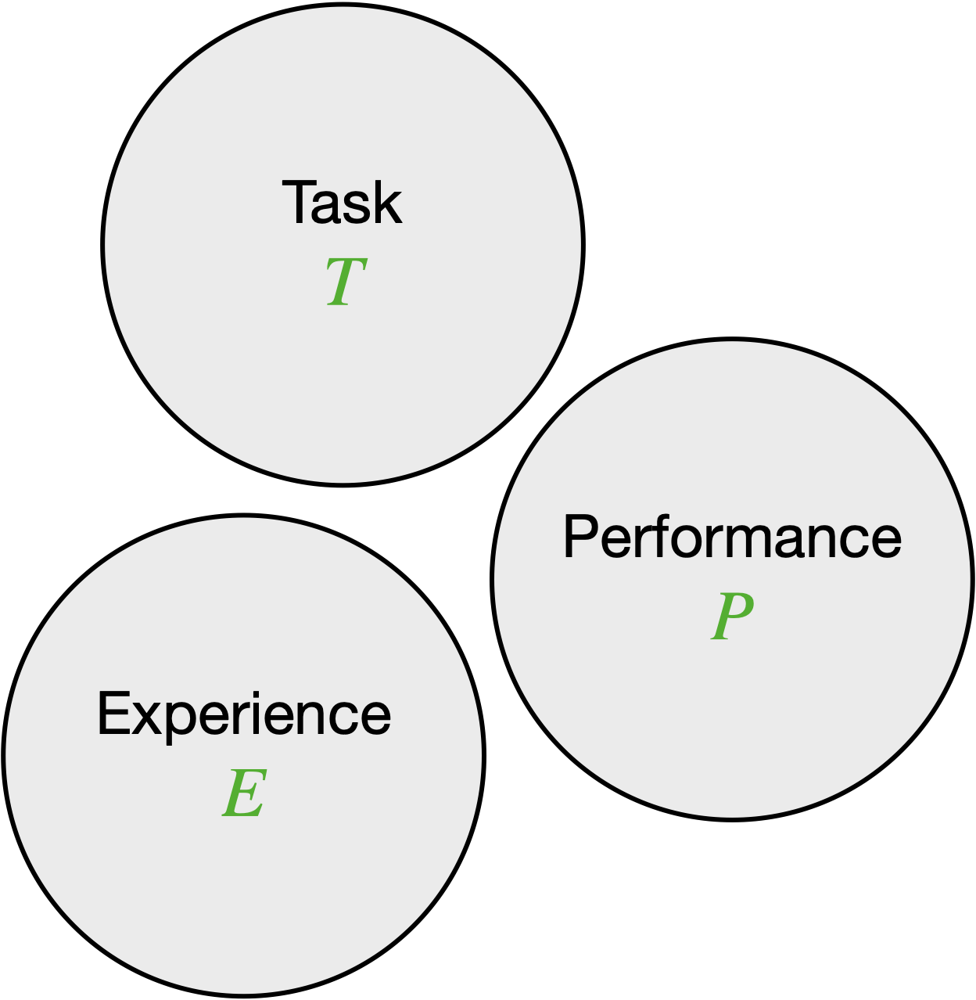

<!-- _class: titlepage-->

# Earth Data Science

Lecture by Léonard Seydoux the master-level classes of the [institut de physique du globe de Paris](https://www.ipgp.fr) with contents inspired by the [scikit-learn](https://scikit-learn.org/stable/) Python library documentation and the [deep learning](https://www.deeplearningbook.org/) book of Ian Goodfellow.

[ `leonard-seydoux/earth-data-science`](https://github.com/leonard-seydoux/earth-data-science)

---

<!-- paginate: true -->

## Learn about statistical inference, machine learning, and deep learning

1. Identify scientific problems in need for data science tools
1. Define the problem and adequate analysis workflows
1. Train on real examples
1. Read AI-based papers with a critical eye

<iframe src="https://www.science.org/doi/10.1126/science.aau0323" width="500px" height="500px"></iframe>

---

## Outlines of this course

1. Introduction on machine learning
2. Deep learning, perceptrons
3. Backpropagation, and gradient descent
4. Generalization error
5. Convolutional neural networks
6. Applications in seismology
7. Other aspects

---

<!-- _class: titlepage-->

# 1. Introduction

What kind of problems can we solve with artificial intelligence?

[ `leonard-seydoux/earth-data-science`](https://github.com/leonard-seydoux/earth-data-science)

---

## How much time do you need to describe the following images?

<!-- _footer:  [Karpathy & Fei-Fei (2015)](https://cs.stanford.edu/people/karpathy/cvpr2015.pdf) -->

---

## How accurate are those descriptions?

<!-- _footer:  [Karpathy & Fei-Fei (2015)](https://cs.stanford.edu/people/karpathy/cvpr2015.pdf) -->

---

## Ingredients for image captioning

<!-- _footer: from Goodfellow et al. (2016) -->

---

## Can you spot the seismogram?

<!-- _footer: from Valentine & Trampert (2012). Top to bottom: FTSE; Temperature in Central England; Gaussian noise; Long-period seismogram.-->

---

## Detection and classification of events from seismograms

Most humans can pinpoint events. 
 

<!-- _footer: modified from Moran et al. (2008) -->

---

## Detection and classification of events from seismograms

Most humans can pinpoint events. 
Experts can also classify them.

<!-- _footer: modified from Moran et al. (2008) -->

---

## Diving into previously unseed data

Expert-detected marsquake within continuous insight data.

<!-- _footer: Clinton et al. (2021) -->

---

## Machine learning to solve tasks that are hard to program

- Tasks that do not find a solution in a reasonable time
- Tasks that are too complex to be programmed
- Tasks that are too complex to be described

---

<!-- _class: titlepage-->

# 2. Definitions

__Machine learning__ is a field of study in artificial intelligence concerned with the development and study of statistical algorithms that can effectively generalize and thus perform tasks without explicit instructions. 

---

## What is machine learning?

__Definition of a learning algorithm__ 
An algorithm learns from experience $E$ with respect to a tasks $T$ and performance $P$, if its performance at tasks in $T$ improves with experience $E$.

<!-- _footer: from Goodfellow et al. (2016) -->

---

## The data, the model, and the loss

### 🙊 __the data__ 

A set of samples and labels to train from 

$$\mathcal{D} = \{(\mathbf{x}_i, \mathbf{y}_i)\}_{i=1}^N$$

where $\mathbf{x}_i$ is the input and $\mathbf{y}_i$ is the output.

### 🙈 the model

A function $f_\theta$ that maps data $\mathbf{x}$ to a prediction $\hat{\mathbf{y}}$ 

$$f_\theta : \mathbf{x} \mapsto \hat{\mathbf{y}}$$

where the set $\theta$ denotes the parameters.

### 🙉 the loss

is a functional that measures the error

$$\mathcal{L}(f_\theta(\mathbf{x}), \mathbf{y})$$

it allows to evaluate the model's performance.

---

## Another more formal definition of learning

Find the optimal parameters $\theta^*$ that minimizes the loss $\mathcal{L}$

$$\theta^* = \arg\min_\theta \mathcal{L}\Big(f_\theta(\mathbf{x}), \mathbf{y}\Big)$$

---

## Useful vocabulary and symbols

| Symbol | Name |
|-:|:-|
|$\left\{ \mathbf{x}_i \in \mathbb{X} \right\}_{i =  1\ldots N}$| Collection of __data samples__|
|$\left\{ \mathbf{y}_i \in \mathbb{Y} \right\}_{i =  1\ldots N}$| Collection of __labels__|
|$\mathbf{x}=\{x_1, \ldots, x_F\}$| Set of sample __features__|
|$\mathbf{y}=\{y_1, \ldots, y_T\}$| Set of label __targets__|
|$N$| Dataset size|
|$F$| Feature space dimensions|
|$T$| Target space dimension|
|$\mathbb{X}$| Data space|
|$\mathbb{Y}$| Label space|

__For instance__, an image is a sample $x$ with 

$$x \in \mathbb{X} = \mathbb{R}^{H \times W \times C}$$

where $H$ is the height, $W$ the width, and $C$ the channels. The label of an image can be represented by a category $y$ with

$$y \in \mathbb{Y} = \{0, 1, \ldots, K\}$$

where $K$ is the number of categories.

---

## Main types of machine learning

__Unsupervised learning__: experience features only, learns properties such as data distribution $p(\mathbf{x})$, or data structure (clustering,  reduction).

__Supervised learning__ experiences examples with features $\mathbf{x} \in \mathbb{X}$ and labels $\mathbf{y} \in \mathbb{Y}$ to predict from the features (regression, classification). 

__Reinforcement learning__ experiences a sequence of states, actions, and rewards, learns a policy to maximize the reward. 

<!-- _footer: illustration from www.mathworks.com -->

---

<!-- _class: titlepage-->

# 3. Supervised machine learning

How to solve a regression or classification task with machine learning?

[ `leonard-seydoux/earth-data-science`](https://github.com/leonard-seydoux/earth-data-science)

---

## The two main tasks of supervised machine learning

__Regression__
$x$ and $y$ are continuous

__Classification__
$x$ is continuous and $y$ is descrete 

--- 

## The regression task

Given a dataset $\mathcal{D} = \{(\mathbf{x}_i, \mathbf{y}_i)\}_{i=1}^N$, find the function $f_\theta$ that best predicts the label $\mathbf{y}$ from the sample $\mathbf{x}$, i.e. find the optimal parameters $\theta^*$ that minimizes the loss. 

---

## The linear regression

Find the set of coefficients $\theta = (a, b) \in \mathbb{R}^2$ that best explain the relationship between $x$ and $y \in \mathbb{R}^2$ so that

$$f_\theta : x \mapsto ax + b.$$

Here, the __best__ explanation is obtained according to a given definition of the loss. For instance, the mean squared error (MSE) is defined as

$$\mathcal{L}(\theta) = \frac{1}{N} \sum_{i=1}^N \left( f_\theta(x_i) - y_i \right)^2.$$

> How do we find the best parameters?

---

## The grid search

Grid search to find $\theta^*$ among gridded values of $\theta$. 

__Pros__: easy to implement, exhaustive search, uncertainty estimation.

__Cons__: unscalable. If 0.1s / evaluation, then 2 parameters with 100 values each takes 1/2 hour. For 5 parameters it takes more than 30 years!

> Any smarter idea? 

---

## Random search

Random search to find $\theta^*$. 

__Pros__: easy to implement, scalable, uncertainty estimation, can include prior knowledge.

__Cons__: not exhaustive, can be slow to converge.

---

## Gradient descent

Estimate the gradient of the loss $\mathcal{L}$ with respect to the parameters $\theta$ and update the parameters in the opposite direction of the gradient.

__Pros__: converges faster than random search.

__Cons__: gets stuck in local minima, slow to converge, needs for differentiable loss, and can be hard to implement.

---

## Gradient descent

__Recipe__

1. Define an initial model $\theta = (a_0, b_0)$
1. Compute the gradient $\nabla \mathcal{L}(\theta)$
1. Update the model $\theta \leftarrow \theta - \eta \nabla \mathcal{L}(\theta)$
1. Repeat until convergence

The __learning rate__ $\eta$ controls the update.
A __training epoch__ is the number of iterations.

---

## How to deal with learning rate?

That's part of the __hyperparameters__ tuning.
More about that in the deep learning lectures.

---

## The problem of overfitting

Having a loss close to 0 does not mean that the model __generalizes__ well.

---

## Key concepts to prevent overfitting: split the dataset

By splitting the dataset into a __training__ and a __testing__ set, we can evaluate the model's performance on unseen data. __You need enough data!__

--- 

## Key concepts to prevent overfitting: regularization

The loss can incorporate a regularization term to penalize the model's complexity.
By adding a regularization term to the loss, we can penalize the model's complexity.

---

## Why so many regression algorithms?

Every algorithm has its own assumptions and hyperparameters. The [scikit-learn](https://scikit-learn.org/stable/) library provides a unified interface to use them.

- Various models
- Various loss functions
- Various regularizations
- Various optimization algorithms

<iframe src="https://scikit-learn.org/stable/supervised_learning.html#supervised-learning" width="400px" height="500px" style="border: none; box-shadow: 0px 0px 20px #ccc; border-radius: 10px; margin-bottom: -20px;"></iframe>

 

---

## Supervised machine learning: the classification task

Classification of sismo-volcanic events: dataset of waveforms $\mathbf{x}$ associated with categorical labels $\mathbf{y}$.

<!-- _footer: from Malfante et al. (2018) -->

---

## Supervised machine learning: the classification task

In other terms, $\mathbf{x}$ lies in $\mathbb{R}^{3 \times N}$, and $\mathbf{y}$ in $[0, \ldots, 5]$. 
Which representation of $\mathbf{x}$ works best?

<!-- _footer: from Malfante et al. (2018) -->

